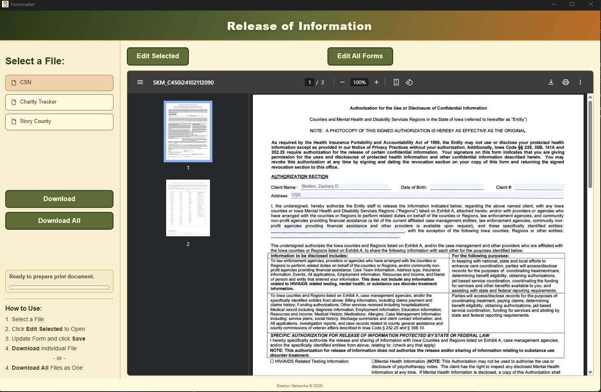
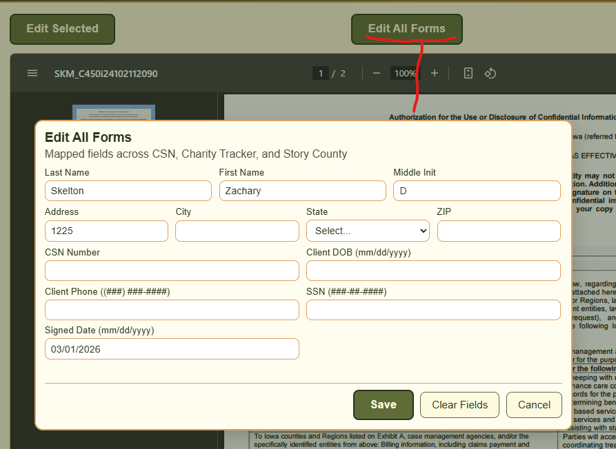
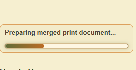
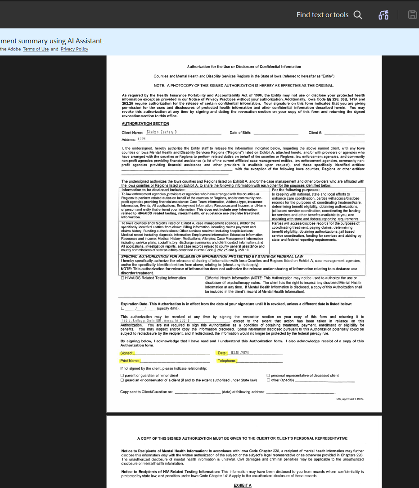

# Formmaker

Desktop form-filling app for Windows (Electron + Vinext) with print-safe PDF download support.

## Maintainer Docs

- [Maintainer Guide](docs/MAINTAINER_GUIDE.md)
- [Changelog](CHANGELOG.md)

## Download (GitHub Releases)

- **Latest release page:** [GitHub Releases](https://github.com/zskelton/formmaker/releases/latest)
- **Latest installer (NSIS):** [Formmaker Setup 1.0.1.exe](https://github.com/zskelton/formmaker/releases/latest/download/Formmaker%20Setup%201.0.1.exe)

> After you publish newer versions, the latest release page link always stays current.

## What this app does

- Opens and fills supported ROI PDF forms.
- Supports single-form and merged-form downloads.
- Uses print-safe output mode for reliable Adobe compatibility in downloaded files.
- Keeps in-app viewing on original PDF assets.

## Install (Windows)

1. Download the latest installer from the release page.
2. Run `Formmaker Setup 1.0.1.exe`.
3. Launch **Formmaker** from Start Menu.

## How to use

1. Open Formmaker.
2. Select a form.
3. Enter or edit values.
4. Use **Download** for an individual print-safe PDF.
5. Use **Download All** for a merged print-safe PDF bundle.

## Demo / QA Checklist (Release Validation)

Use this checklist before publishing a release:

- [ ] Installer file exists (`Formmaker Setup 1.0.1.exe`) in release artifacts.
- [ ] Fresh install on Windows completes successfully.
- [ ] App launches and remains open (no splash crash).
- [ ] At least one form opens with expected default structure.
- [ ] Save/edit flow updates fields correctly.
- [ ] **Download** (single form) completes and opens in Adobe.
- [ ] **Download All** (merged) completes and opens in Adobe.
- [ ] Downloaded PDFs show expected values and no Adobe page errors.
- [ ] Charity Tracker mapping check:
  - [ ] Address saves/loads as address value.
  - [ ] City + State combine/split correctly for mapped field behavior.

## Screenshots

Add screenshots to `docs/screenshots/` and keep the names below for consistent README rendering.

### Main UI

### Filled Form Example

### Download Progress Panel

### Merged Output Example

## GitHub Release Publishing

This repo includes a GitHub Actions workflow to build and publish installer assets when you push a version tag.

### Automated publish (recommended)

1. Commit your changes to `main`.
2. Create and push a semantic version tag:
   - `git tag v1.0.1`
   - `git push origin v1.0.1`
3. GitHub Actions builds NSIS installer and attaches artifacts to a GitHub Release.

### Manual publish (fallback)

1. Build locally: `npm run build:nsis`
2. Open: [Releases](https://github.com/zskelton/formmaker/releases)
3. Click **Draft a new release**.
4. Set tag (example `v1.0.1`) and title.
5. Upload from local `release/`:
   - `Formmaker Setup 1.0.1.exe`
   - `Formmaker Setup 1.0.1.exe.blockmap`
   - `latest.yml`
6. Publish release.

## Developer commands

- `npm run dev:desktop` — run desktop in development.
- `npm run build:nsis` — build Windows NSIS installer.
- `npm run build:portable` — build Windows portable executable.
